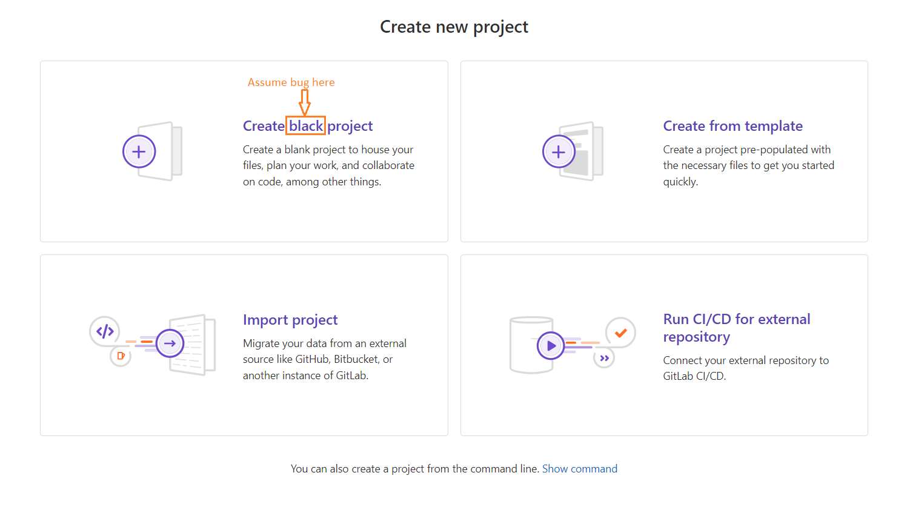

## Summary (Summarize the bug encountered concisely)

In New Project page, there is a typo. Instead of "blank" it says "black."

## Steps to reproduce     

Open browser, sign in to Gitlab, Select New Project, Typo is in that page.
URL to bug: https://gitlab.com/projects/new

## What is the current bug behavior?

Creating new blank project, title says "black project"     

## What is the expected correct behavior?

The topic should say "blank project"
     
## Relevant logs and/or screenshots

 

## Possible fixes

Edit the topic and change black to blank

## Whom do you report/ Assign To/ Tags

label ~bug ~reproduced cc @project-manager

## Priority

Minor      
